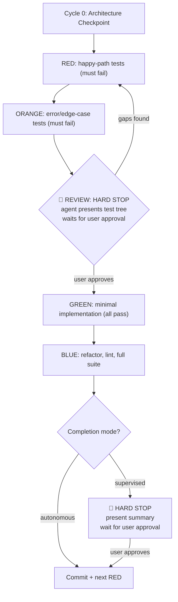

# TDD: RED / ORANGE / REVIEW / GREEN / BLUE

Five-phase test-driven development cycle. Tests are written first, reviewed collaboratively, then implemented minimally and refactored.



## Cycle 0: Architecture Checkpoint

Before writing any tests, document key decisions that affect the entire feature:

- Data types and storage format (integers vs floats, string vs numeric, base units vs display units)
- API contracts (request/response shapes, headers, status codes)
- External dependencies (what gets mocked, what gets called)
- Error strategy (exceptions vs result types, retry behavior)

Cycle 0 runs once per feature, not per cycle. Its purpose is to prevent costly rework from late-stage architectural discoveries.

## Phase Definitions

### RED -- Happy-Path Tests

Write tests for the expected successful behavior. Call the function/method under test with valid inputs and assert correct outputs.

- Tests MUST fail (function doesn't exist yet or returns wrong values)
- Run tests to confirm failures
- **If a test passes unexpectedly**: stop and investigate. Either the test is wrong, the feature already exists, or the assertion isn't testing what you think. Never treat unexpected passes as freebies.
- **Tests must be implementable**: every test must be passable by a correct implementation. Before writing a test, mentally trace the implementation path and verify the test will pass when the code works correctly. A test that can never pass (e.g., asserting on unmocked externals, expecting a return value the API can't produce) is worse than no test.

### ORANGE -- Error and Edge-Case Tests

Write tests for bad input, missing dependencies, boundary values, and external failures.

- Tests MUST fail
- Run tests to confirm failures
- Same rule: **unexpected passes must be investigated**
- Same rule: **tests must be implementable** -- error-path tests that rely on unmocked dependencies throwing for the wrong reason (e.g., `TypeError: not a function` instead of the intended error message) are testing the mock setup, not the feature.

### Mock Correctness

When tests depend on mocked externals (HTTP calls, database, Solana RPC, etc.), follow these rules:

1. **Mock at the right layer.** Mock the external boundary (e.g., `fetch`, `Connection.sendRawTransaction`), not internals of the unit under test. If the implementation deserializes a transaction before signing, the test must mock the deserialization too -- otherwise the test will fail for the wrong reason in GREEN.
2. **Trace the call path before writing the test.** For each test, mentally walk through: "the implementation will call A, which calls B, which returns C." Ensure every external in that path is either mocked or will work with test data. If something in the chain is unmocked and will throw, the test is not implementable.
3. **Assert the right thing.** If you mock `fetch` to return a canned response, assert on the parsed output of your method -- not on the raw mock. If you mock an RPC call to reject, assert the specific error message your implementation will wrap/propagate, not a generic `.toThrow()`.
4. **Avoid coincidental passes.** A test that passes because a non-existent method throws `TypeError` is not testing your error handling. Use specific error message matchers (e.g., `.toThrow("No signing keypair configured")`) instead of bare `.toThrow()`.
5. **Set up mocks before the call, not after.** Ensure mock state is configured in `beforeEach` or at the top of the test, before invoking the method under test. Mocks configured after the call do nothing.

### REVIEW -- Collaborative Quality Gate

The agent and human jointly verify that the test suite fully specifies the feature before any implementation is written. This phase iterates until both sides are confident.

**Step 1 -- Cycle summary.** Start the REVIEW with a brief summary block:
- **Cycle goal**: one sentence describing what this cycle delivers (e.g., "Core OrderExecutionService with keypair parsing, quote fetching, and swap submission")
- **Files touched**: list of files created or modified in this cycle
- **Test count**: N RED + M ORANGE = total

**Step 2 -- Function signatures.** Print the signatures of all functions/methods that will be created or modified in GREEN as a **syntax-highlighted TypeScript code block**. Format for readability:

- Use JSDoc-style comments to describe each function
- Break long signatures across multiple lines (one param per line when > ~80 chars)
- Indent continuation lines for parameters
- Separate each function with a blank line

```typescript
// Example format:

/** Return base58 pubkey of configured keypair. Throws if no keypair. */
getWalletAddress(): string

/** Fetch swap quote from the Phantom swapper API. */
async getQuote(params: {
  sellToken: string;
  buyToken: string;
  sellAmount: string;
  slippageBps?: number;
}): Promise<SwapQuote>

/** Get quote, sign transaction with local keypair, submit to RPC. */
async executeSwap(
  params: ExecuteSwapParams,
): Promise<SwapExecutionResult>
```

**Step 3 -- Agent self-review.** Examine the full `describe`/`it` tree and ask:
- Are there missing scenarios?
- Logical gaps or contradictory assumptions?
- Untested boundaries or error paths?
- Does the test set fully specify the feature?

**Step 4 -- Present findings.** Print the complete test description tree. Call out any gaps or concerns explicitly:
- "I notice we don't test what happens when X is null."
- "Should Y also handle the case where Z returns an empty array?"

**Step 5 -- Human review.** The user inspects test descriptions, validates assumptions, and may request additions.

**Step 6 -- Iterate.** If either side identifies missing tests, loop back to RED (happy-path gaps) or ORANGE (error/edge-case gaps). Write them, run to confirm failure, return to REVIEW.

**Step 7 -- Gate.** **HARD STOP. Do NOT proceed to GREEN.** After presenting the test tree and findings, you MUST stop and wait for the user's next message. Only proceed to GREEN when the user explicitly approves (e.g., "approved", "looks good", "continue", "go ahead"). Silence or lack of objection is NOT approval. If the user asks for changes, loop back to RED/ORANGE, then return to REVIEW and STOP again.

### GREEN -- Minimal Implementation

Write the minimum code to make all RED + ORANGE tests pass.

- No refactoring, no extra features, no cleanup
- Run tests to confirm all pass
- If a test still fails, fix the implementation, not the test

### BLUE -- Refactor and Verify

Refactor for clarity, DRYness, and readability. Then verify everything.

- Run linter and fix any issues
- Run the **full** test suite (all cycles, not just the current one) to catch cross-cycle regressions
- **Surface forward concerns**: if the implementation reveals issues that belong in a future cycle, note them as backlog items. Do not scope-creep the current cycle (e.g., "this works but is not atomic -- consider a transaction cycle later")

After BLUE, the cycle completes in one of two modes:

- **Supervised (default)**: Present a summary of what was implemented and tested. **HARD STOP. Do NOT commit, and do NOT start the next cycle.** Wait for the user's explicit approval before committing. After committing, wait for the user to say "continue" before starting the next cycle's RED phase. Two separate user messages are required: one to approve the commit, one to start the next cycle.
- **Autonomous**: The user has explicitly said "continue autonomously" or "keep going". Only then may the agent commit and immediately start the next cycle's RED phase without pausing.

The default is **supervised**. The user must explicitly opt into autonomous mode. The agent MUST ask which mode the user prefers at the start of a multi-cycle session if not already established. The user can switch modes at any time.

**Commit messages** reference the cycle for traceability: `feat(scope): description [cycle N]`

## Test Structure as Documentation

Tests are the primary feature documentation. A reviewer should understand every behavior, every error path, and every assumption by reading the `describe`/`it` tree alone.

### Hierarchy

- **`describe` blocks** = the unit under test (function, method, class)
- **Nested `describe` blocks** = scenario category: `"core behavior"`, `"error handling"`, `"edge cases"`, `"boundary conditions"`
- **`it` blocks** = complete sentences starting with a verb: returns, throws, rejects, skips, handles

### Naming Rules

- Be specific with expected values: `"returns '333' when 1000 is split across 3 remaining intervals"`
- Not vague: `"calculates correctly"`, `"handles errors"`, `"works"`
- Group RED tests under `"core behavior"`, ORANGE tests under `"error handling"` / `"edge cases"` / `"boundary conditions"`

### Example Tree

```text
describe("calculateFillAmount")
  describe("core behavior")
    it("divides total evenly across remaining intervals")
    it("returns '0' when total is fully filled")
    it("accounts for prior fills from execution history")
  describe("error handling")
    it("returns '0' when remaining intervals is zero")
    it("throws when total_quantity is not a valid integer string")
  describe("boundary conditions")
    it("handles values exceeding Number.MAX_SAFE_INTEGER")
    it("truncates toward zero on non-even division")
```

## Cycle Planning

Each cycle targets one unit of behavior: one service method, one validation rule, one query.

- Cycles should produce ~5-15 tests across RED + ORANGE
- Create a todo list before starting with one item per phase per cycle
- One cycle at a time -- finish BLUE before starting the next RED

## Rules

1. Never write implementation before RED tests exist
2. Never skip ORANGE -- error paths catch more bugs than happy paths
3. **REVIEW is a HARD STOP** -- present findings and the test tree, then STOP. Do not proceed to GREEN until the user explicitly approves in a separate message
4. REVIEW loops back to RED/ORANGE as many times as needed
5. GREEN must be minimal -- no refactoring, no extras
6. BLUE is for refactoring only -- no new behavior
7. Run tests after every phase transition; run the FULL suite in BLUE
8. **BLUE is a HARD STOP (supervised mode)** -- present results and STOP. Do not commit or start the next cycle until the user explicitly says to proceed
9. **NEVER start the next cycle's RED before the current cycle is committed** -- uncommitted work must be committed first. No exceptions.
10. Unexpected passes in RED/ORANGE are bugs in the test -- investigate
11. Architectural decisions belong in Cycle 0, not discovered mid-implementation
12. BLUE surfaces forward concerns as backlog, never scope-creeps the current cycle
13. Test descriptions are specifications -- write them for someone who has never seen the code
14. Commit messages reference the cycle: `feat(scope): description [cycle N]`
15. Every test must be implementable -- mentally trace the implementation before writing the test. If a correct implementation cannot make the test pass (missing mocks, wrong assertions, impossible return values), fix the test before moving on
16. Mock at the external boundary and verify the full call chain is covered -- unmocked externals in the middle of the chain cause tests to fail for the wrong reason in GREEN

## Anti-Patterns

- Writing tests and implementation together
- Skipping ORANGE and only testing happy paths
- Over-implementing in GREEN (features tests don't require)
- Refactoring in GREEN instead of waiting for BLUE
- Making REVIEW a rubber stamp -- agent must actively audit
- Skipping the REVIEW loop -- go back to RED/ORANGE, don't sneak tests into GREEN
- **Presenting the REVIEW test tree and immediately proceeding to GREEN in the same turn** -- REVIEW requires a HARD STOP; the user must respond before GREEN begins
- **Completing BLUE and immediately starting the next cycle's RED** -- in supervised mode, each cycle boundary requires user approval before continuing
- **Starting the next cycle's RED with uncommitted changes from the previous cycle** -- always commit before moving on; uncommitted work is invisible to future diffs and reviews
- Vague test names: `"works correctly"`, `"handles errors"`
- Flat test files with no `describe` grouping
- **Writing tests that can't pass with a correct implementation** -- e.g., asserting on unmocked externals, expecting values the method can't return, or relying on `TypeError: not a function` as a substitute for real error handling
- **Using bare `.toThrow()` when a specific error message is expected** -- coincidental passes from `TypeError` or mock setup errors hide real bugs
- **Forgetting to mock intermediate externals in the call chain** -- if `executeSwap` calls `getQuote` which calls `fetch`, and then deserializes via `VersionedTransaction.deserialize`, all three layers need mocking for the `executeSwap` test to be implementable

## Example: One Full Cycle

Feature: `calculateDiscount(price: number, percentage: number): number`

**RED**
```text
describe("calculateDiscount")
  describe("core behavior")
    it("returns 90 for price=100 and percentage=10")
    it("returns 0 for price=100 and percentage=100")
    it("returns the original price when percentage is 0")
```
Run tests -- all fail (function doesn't exist). Confirmed RED.

**ORANGE**
```text
  describe("error handling")
    it("throws when percentage is negative")
    it("throws when percentage exceeds 100")
    it("throws when price is negative")
  describe("boundary conditions")
    it("returns 0.01 for price=0.01 and percentage=0")
    it("handles percentage=99.999 without floating point artifacts")
```
Run tests -- all fail. Confirmed ORANGE.

**REVIEW**

**Cycle goal**: Pure discount calculator with input validation.
**Files touched**: `src/pricing/discount.ts` (new), `src/pricing/__test__/discount.spec.ts` (new)
**Test count**: 3 RED + 5 ORANGE = 8

**Function signatures**:
```typescript
/** Apply percentage discount to price. Throws on negative inputs or percentage > 100. */
calculateDiscount(
  price: number,
  percentage: number,
): number
```

Agent prints the full tree and notes: "We don't test what happens when price is 0 -- should that return 0 or throw?" Human says: "Return 0, add a test." Loop back to RED, add `it("returns 0 when price is 0")`, confirm failure, return to REVIEW. Both satisfied -- proceed.

**GREEN**
```typescript
function calculateDiscount(price: number, percentage: number): number {
  if (price < 0) throw new Error("price must be non-negative");
  if (percentage < 0 || percentage > 100) throw new Error("percentage must be 0-100");
  return price * (1 - percentage / 100);
}
```
Run tests -- all pass. Confirmed GREEN.

**BLUE**

No refactoring needed for this simple function. Run linter -- clean. Run full suite -- no regressions. Note forward concern: "Floating point precision may need attention for financial use cases -- consider integer math in a future cycle."

Commit: `feat(pricing): add calculateDiscount with validation [cycle 1]`
