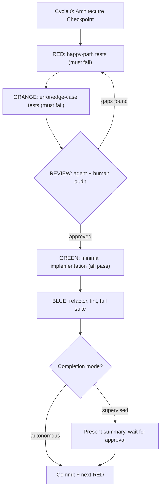

# TDD: RED / ORANGE / REVIEW / GREEN / BLUE

Five-phase test-driven development cycle. Tests are written first, reviewed collaboratively, then implemented minimally and refactored.



## Cycle 0: Architecture Checkpoint

Before writing any tests, document key decisions that affect the entire feature:

- Data types and storage format (integers vs floats, string vs numeric, base units vs display units)
- API contracts (request/response shapes, headers, status codes)
- External dependencies (what gets mocked, what gets called)
- Error strategy (exceptions vs result types, retry behavior)

Cycle 0 runs once per feature, not per cycle. Its purpose is to prevent costly rework from late-stage architectural discoveries.

## Phase Definitions

### RED -- Happy-Path Tests

Write tests for the expected successful behavior. Call the function/method under test with valid inputs and assert correct outputs.

- Tests MUST fail (function doesn't exist yet or returns wrong values)
- Run tests to confirm failures
- **If a test passes unexpectedly**: stop and investigate. Either the test is wrong, the feature already exists, or the assertion isn't testing what you think. Never treat unexpected passes as freebies.

### ORANGE -- Error and Edge-Case Tests

Write tests for bad input, missing dependencies, boundary values, and external failures.

- Tests MUST fail
- Run tests to confirm failures
- Same rule: **unexpected passes must be investigated**

### REVIEW -- Collaborative Quality Gate

The agent and human jointly verify that the test suite fully specifies the feature before any implementation is written. This phase iterates until both sides are confident.

**Step 1 -- Agent self-review.** Examine the full `describe`/`it` tree and ask:
- Are there missing scenarios?
- Logical gaps or contradictory assumptions?
- Untested boundaries or error paths?
- Does the test set fully specify the feature?

**Step 2 -- Present findings.** Print the complete test description tree. Call out any gaps or concerns explicitly:
- "I notice we don't test what happens when X is null."
- "Should Y also handle the case where Z returns an empty array?"

**Step 3 -- Human review.** The user inspects test descriptions, validates assumptions, and may request additions.

**Step 4 -- Iterate.** If either side identifies missing tests, loop back to RED (happy-path gaps) or ORANGE (error/edge-case gaps). Write them, run to confirm failure, return to REVIEW.

**Step 5 -- Gate.** Proceed to GREEN only when both agent and human agree the suite is complete. No logic gaps, no missing error paths, no unclear assumptions.

### GREEN -- Minimal Implementation

Write the minimum code to make all RED + ORANGE tests pass.

- No refactoring, no extra features, no cleanup
- Run tests to confirm all pass
- If a test still fails, fix the implementation, not the test

### BLUE -- Refactor and Verify

Refactor for clarity, DRYness, and readability. Then verify everything.

- Run linter and fix any issues
- Run the **full** test suite (all cycles, not just the current one) to catch cross-cycle regressions
- **Surface forward concerns**: if the implementation reveals issues that belong in a future cycle, note them as backlog items. Do not scope-creep the current cycle (e.g., "this works but is not atomic -- consider a transaction cycle later")

After BLUE, the cycle completes in one of two modes:

- **Supervised (default)**: Present a summary of what was implemented and tested. Wait for user approval before committing. Wait for "continue" before the next cycle.
- **Autonomous**: Commit and immediately start the next cycle's RED phase. The user enables this by saying "continue autonomously" or "keep going."

The user can switch modes at any time. Ask which mode they prefer at the start of a multi-cycle session.

**Commit messages** reference the cycle for traceability: `feat(scope): description [cycle N]`

## Test Structure as Documentation

Tests are the primary feature documentation. A reviewer should understand every behavior, every error path, and every assumption by reading the `describe`/`it` tree alone.

### Hierarchy

- **`describe` blocks** = the unit under test (function, method, class)
- **Nested `describe` blocks** = scenario category: `"core behavior"`, `"error handling"`, `"edge cases"`, `"boundary conditions"`
- **`it` blocks** = complete sentences starting with a verb: returns, throws, rejects, skips, handles

### Naming Rules

- Be specific with expected values: `"returns '333' when 1000 is split across 3 remaining intervals"`
- Not vague: `"calculates correctly"`, `"handles errors"`, `"works"`
- Group RED tests under `"core behavior"`, ORANGE tests under `"error handling"` / `"edge cases"` / `"boundary conditions"`

### Example Tree

```text
describe("calculateFillAmount")
  describe("core behavior")
    it("divides total evenly across remaining intervals")
    it("returns '0' when total is fully filled")
    it("accounts for prior fills from execution history")
  describe("error handling")
    it("returns '0' when remaining intervals is zero")
    it("throws when total_quantity is not a valid integer string")
  describe("boundary conditions")
    it("handles values exceeding Number.MAX_SAFE_INTEGER")
    it("truncates toward zero on non-even division")
```

## Cycle Planning

Each cycle targets one unit of behavior: one service method, one validation rule, one query.

- Cycles should produce ~5-15 tests across RED + ORANGE
- Create a todo list before starting with one item per phase per cycle
- One cycle at a time -- finish BLUE before starting the next RED

## Rules

1. Never write implementation before RED tests exist
2. Never skip ORANGE -- error paths catch more bugs than happy paths
3. REVIEW is collaborative -- the agent actively audits for gaps, not just lists tests and waits
4. REVIEW loops back to RED/ORANGE as many times as needed
5. GREEN must be minimal -- no refactoring, no extras
6. BLUE is for refactoring only -- no new behavior
7. Run tests after every phase transition; run the FULL suite in BLUE
8. Unexpected passes in RED/ORANGE are bugs in the test -- investigate
9. Architectural decisions belong in Cycle 0, not discovered mid-implementation
10. BLUE surfaces forward concerns as backlog, never scope-creeps the current cycle
11. Test descriptions are specifications -- write them for someone who has never seen the code
12. Commit messages reference the cycle: `feat(scope): description [cycle N]`

## Anti-Patterns

- Writing tests and implementation together
- Skipping ORANGE and only testing happy paths
- Over-implementing in GREEN (features tests don't require)
- Refactoring in GREEN instead of waiting for BLUE
- Making REVIEW a rubber stamp -- agent must actively audit
- Skipping the REVIEW loop -- go back to RED/ORANGE, don't sneak tests into GREEN
- Vague test names: `"works correctly"`, `"handles errors"`
- Flat test files with no `describe` grouping

## Example: One Full Cycle

Feature: `calculateDiscount(price: number, percentage: number): number`

**RED**
```text
describe("calculateDiscount")
  describe("core behavior")
    it("returns 90 for price=100 and percentage=10")
    it("returns 0 for price=100 and percentage=100")
    it("returns the original price when percentage is 0")
```
Run tests -- all fail (function doesn't exist). Confirmed RED.

**ORANGE**
```text
  describe("error handling")
    it("throws when percentage is negative")
    it("throws when percentage exceeds 100")
    it("throws when price is negative")
  describe("boundary conditions")
    it("returns 0.01 for price=0.01 and percentage=0")
    it("handles percentage=99.999 without floating point artifacts")
```
Run tests -- all fail. Confirmed ORANGE.

**REVIEW**

Agent prints the full tree and notes: "We don't test what happens when price is 0 -- should that return 0 or throw?" Human says: "Return 0, add a test." Loop back to RED, add `it("returns 0 when price is 0")`, confirm failure, return to REVIEW. Both satisfied -- proceed.

**GREEN**
```typescript
function calculateDiscount(price: number, percentage: number): number {
  if (price < 0) throw new Error("price must be non-negative");
  if (percentage < 0 || percentage > 100) throw new Error("percentage must be 0-100");
  return price * (1 - percentage / 100);
}
```
Run tests -- all pass. Confirmed GREEN.

**BLUE**

No refactoring needed for this simple function. Run linter -- clean. Run full suite -- no regressions. Note forward concern: "Floating point precision may need attention for financial use cases -- consider integer math in a future cycle."

Commit: `feat(pricing): add calculateDiscount with validation [cycle 1]`
